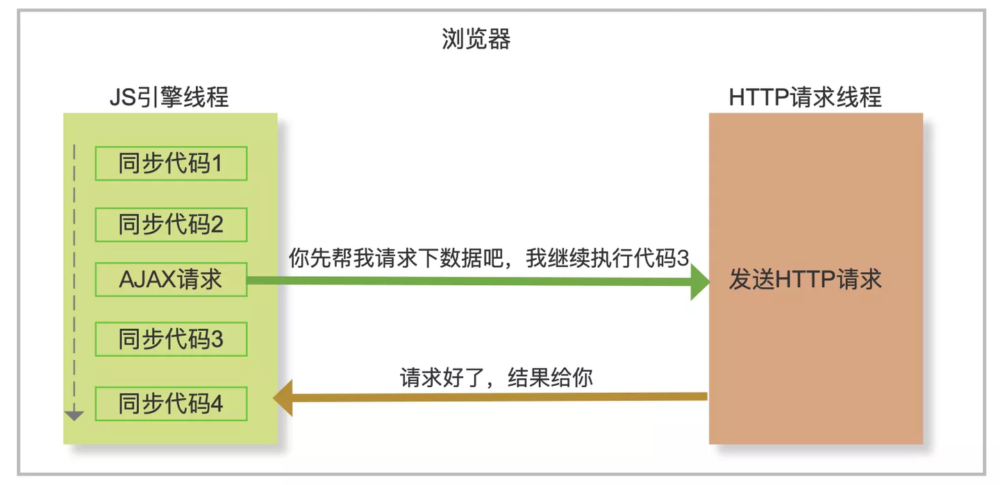
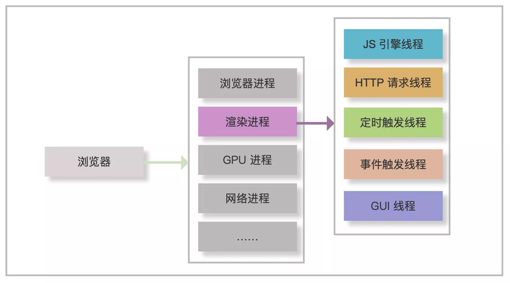
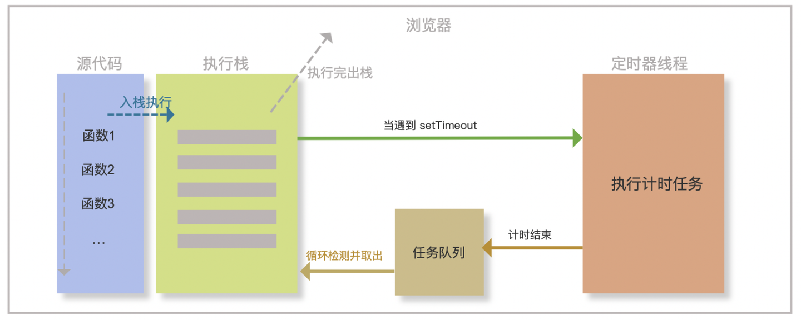
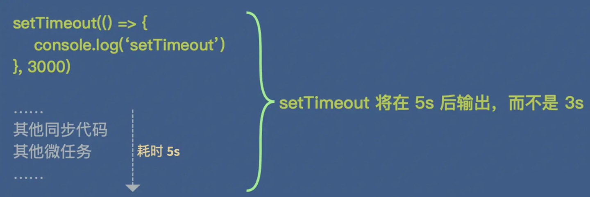
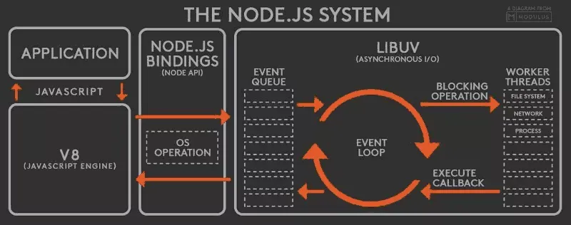
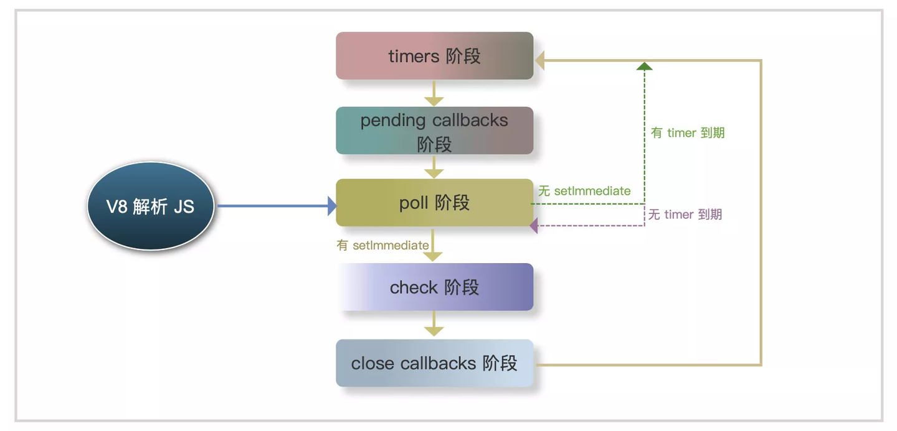

## **浏览器 JS 异步执行的原理**

JS 是单线程的，也就是同一个时刻只能做一件事情，那么思考：为什么浏览器可以同时执行异步任务呢？

因为浏览器是多线程的，当 JS 需要执行异步任务时，浏览器会另外启动一个线程去执行该任务。也就是说，“JS 是单线程的”指的是执行 JS 代码的线程只有一个，是浏览器提供的 JS 引擎线程（主线程）。浏览器中还有定时器线程和 HTTP 请求线程等，这些线程主要不是来跑 JS 代码的。

比如主线程中需要发一个 AJAX 请求，就把这个任务交给另一个浏览器线程（HTTP 请求线程）去真正发送请求，待请求回来了，再将 callback 里需要执行的 JS 回调交给 JS 引擎线程去执行。 **即浏览器才是真正执行发送请求这个任务的角色，而 JS 只是负责执行最后的回调处理。** 所以这里的异步不是 JS 自身实现的，其实是浏览器为其提供的能力。



以 Chrome 为例，浏览器不仅有多个线程，还有多个进程，如渲染进程、GPU 进程和插件进程等。而每个 tab 标签页都是一个独立的渲染进程，所以一个 tab 异常崩溃后，其他 tab 基本不会被影响。



## **事件驱动浅析**

浏览器异步任务的执行原理背后其实是一套事件驱动的机制。事件触发、任务选择和任务执行都是由事件驱动机制来完成的。NodeJS 和浏览器的设计都是基于事件驱动的，简而言之就是由特定的事件来触发特定的任务，这里的事件可以是用户的操作触发的，如 click 事件；也可以是程序自动触发的，比如浏览器中定时器线程在计时结束后会触发定时器事件。而本文的主题内容 **事件循环其实就是在事件驱动模式中来管理和执行事件的一套流程** 。

以一个简单场景为例，假设游戏界面上有一个移动按钮和人物模型，每次点击右移后，人物模型的位置需要重新渲染，右移 1 像素。根据渲染时机的不同我们可以用不同的方式来实现。


**实现方式一：事件驱动。** 点击按钮后，修改坐标 positionX 时，立即触发界面渲染的事件，触发重新渲染。

**实现方式二：状态驱动或数据驱动。** 点击按钮后，只修改坐标 positionX，不触发界面渲染。在此之前会启动一个定时器 setInterval，或者利用 requestAnimationFrame 来不断地检测 positionX 是否有变化。如果有变化，则立即重新渲染。也就是轮询。

浏览器中的点击事件处理也是典型的基于事件驱动。在事件驱动中，当有事件触发后，被触发的事件会按顺序暂时存在一个队列中，待 JS 的同步任务执行完成后，会从这个队列中取出要处理的事件并进行处理。那么具体什么时候取任务、优先取哪些任务，这就由事件循环流程来控制了。

## **浏览器中的事件循环**

### **执行栈与任务队列**

JS 在解析一段代码时，会将同步代码按顺序排在某个地方，即执行栈，然后依次执行里面的函数。当遇到异步任务时就交给其他线程处理，待当前执行栈所有同步代码执行完成后，会从一个队列中去取出已完成的异步任务的回调加入执行栈继续执行，遇到异步任务时又交给其他线程，.....，如此循环往复。而其他异步任务完成后，将回调放入任务队列中待执行栈来取出执行。

JS 按顺序执行执行栈中的方法，每次执行一个方法时，会为这个方法生成独有的执行环境（上下文 context)，待这个方法执行完成后，销毁当前的执行环境，并从栈中弹出此方法（即消费完成），然后继续下一个方法。

可见，在事件驱动的模式下，至少包含了一个执行循环来检测任务队列是否有新的任务。通过不断循环去取出异步回调来执行，这个过程就是事件循环，而每一次循环就是一个事件周期或称为一次 tick。

### **宏任务和微任务**

任务队列不只一个，根据任务的种类不同，可以分为微任务（micro task）队列和宏任务（macro task）队列。

事件循环的过程中，执行栈在同步代码执行完成后，优先检查微任务队列是否有任务需要执行，如果没有，再去宏任务队列检查是否有任务执行，如此往复。微任务一般在当前循环就会优先执行，而宏任务会等到下一次循环， **因此，微任务一般比宏任务先执行，并且微任务队列只有一个，宏任务队列可能有多个** 。另外我们常见的点击和键盘等事件也属于宏任务。

下面我们看一下常见宏任务和常见微任务。

**常见宏任务：**

- setTimeout()
- setInterval()
- setImmediate()

**常见微任务：**

- promise.then()、promise.catch()
- new MutaionObserver()
- process.nextTick()

```JavaScript
console.log('同步代码1');
setTimeout(() => {
    console.log('setTimeout')
}, 0)
new Promise((resolve) => {
  console.log('同步代码2')
  resolve()
}).then(() => {
    console.log('promise.then')
})
console.log('同步代码3');
// 最终输出"同步代码1"、"同步代码2"、"同步代码3"、"promise.then"、"setTimeout"
```

上面的代码将按如下顺序输出为："同步代码 1"、"同步代码 2"、"同步代码 3"、"promise.then"、"setTimeout"，具体分析如下。

（1）setTimeout 回调和 promise.then 都是异步执行的，将在所有同步代码之后执行；

> _顺便提一下，在浏览器中 setTimeout 的延时设置为 0 的话，会默认为 4ms，NodeJS 为 1ms。具体值可能不固定，但不是为 0。_

（2）虽然 promise.then 写在后面，但是执行顺序却比 setTimeout 优先，因为它是微任务；

（3）new Promise 是同步执行的，promise.then 里面的回调才是异步的。

下面我们看一下上面代码的执行过程演示：

<video src="https://vdn6.vzuu.com/SD/d2107ad6-f5c0-11eb-a6b8-fe2d7343ba6d.mp4?pkey=AAXCXOyWgUQVTFwDhBMbTqqX48d1ZsFmCTVM-QK8qzIY_cCQt6G2SscRda6SFoQeoWEpb5Ncc67eoO0nKIVcLQRP&c=avc.0.0&f=mp4&pu=078babd7&bu=078babd7&expiration=1703061619&v=ks6" controls></video>

也有人这样去理解：微任务是在当前事件循环的尾部去执行；宏任务是在下一次事件循环的开始去执行。我们来看看微任务和宏任务的本质区别是什么。

我们已经知道，JS 遇到异步任务时会将此任务交给其他线程去处理，自己的主线程继续往后执行同步任务。比如 setTimeout 的计时会由浏览器的定时器线程来处理，待计时结束，就将定时器回调任务放入任务队列等待主线程来取出执行。前面我们提到，因为 JS 是单线程执行的，所以要执行异步任务，就需要浏览器其他线程来辅助，即多线程是 JS 异步任务的一个明显特征。

我们再来分析下 promise.then（微任务）的处理。当执行到 promise.then 时，V8 引擎不会将异步任务交给浏览器其他线程，而是将回调存在自己的一个队列中，待当前执行栈执行完成后，立马去执行 promise.then 存放的队列，promise.then 微任务没有多线程参与，甚至从某些角度说，微任务都不能完全算是异步，它只是将书写时的代码修改了执行顺序而已。

setTimeout 有“定时等待”这个任务，需要定时器线程执行；ajax 请求有“发送请求”这个任务，需要 HTTP 线程执行，而 promise.then 它没有任何异步任务需要其他线程执行，它只有回调，即使有，也只是内部嵌套的另一个宏任务。

简单小结一下微任务和宏任务的本质区别。

- **宏任务特征** ：有明确的异步任务需要执行和回调；需要其他异步线程支持。
- **微任务特征** ：没有明确的异步任务需要执行，只有回调；不需要其他异步线程支持。

### **定时器误差**

事件循环中，总是先执行同步代码后，才会去任务队列中取出异步回调来执行。当执行 setTimeout 时，浏览器启动新的线程去计时，计时结束后触发定时器事件将回调存入宏任务队列，等待 JS 主线程来取出执行。如果这时主线程还在执行同步任务的过程中，那么此时的宏任务就只有先挂起，这就造成了计时器不准确的问题。同步代码耗时越长，计时器的误差就越大。不仅同步代码，由于微任务会优先执行，所以微任务也会影响计时，假设同步代码中有一个死循环或者微任务中递归不断在启动其他微任务，那么宏任务里面的代码可能永远得不到执行。所以主线程代码的执行效率提升是一件很重要的事情。



一个很简单的场景就是我们界面上有一个时钟精确到秒，每秒更新一次时间。你会发现有时候秒数会直接跳过 2 秒间隔，就是这个原因。

下面这段代码，回调函数 1 秒后执行，主线程等到 10 秒，最后回调函数在主函数后执行。

```JavaScript
setTimeout(function () {
    console.log("exec done");
}, 1000)

// 主线程休眠10秒
const delay = 10000; // 延时时间，单位：毫秒

const startTime = new Date().getTime(); // 获取当前时间戳
let cur;
while ((cur = new Date().getTime()) - startTime < delay) {
    // 空循环，延时等待
}

console.log(`main process done, time consuming ${cur - startTime} ms`);
```

## **NodeJS 中的事件循环**

JS 引擎本身不实现事件循环机制，这是由它的宿主实现的，浏览器中的事件循环主要是由浏览器来实现，而在 NodeJS 中也有自己的事件循环实现。NodeJS 中也是循环 + 任务队列的流程以及微任务优先于宏任务，大致表现和浏览器是一致的。不过它与浏览器中也有一些差异，并且新增了一些任务类型和任务阶段。接下来我们介绍下 NodeJS 中的事件循环流程。

### **NodeJS 中的异步方法**

因为都是基于 V8 引擎，浏览器中包含的异步方式在 NodeJS 中也是一样的。另外 NodeJS 中还有一些其他常见异步形式。

- 文件 I/O：异步加载本地文件。
- setImmediate()：与 setTimeout 设置 0ms 类似，在某些同步任务完成后立马执行。
- process.nextTick()：在某些同步任务完成后立马执行。
- server.close、socket.on('close',...）等：关闭回调。

想象一下，如果上面的形式和 setTimeout、promise 等同时存在，如何分析出代码的执行顺序呢？只要我们理解了 NodeJS 的事件循环机制，也就清楚了。

### **事件循环模型**

NodeJS 的跨平台能力和事件循环机制都是基于 Libuv 库实现的，你不用关心这个库的具体内容。我们只需要知道 Libuv 库是事件驱动的，并且封装和统一了不同平台的 API 实现。NodeJS 中 V8 引擎将 JS 代码解析后调用 Node API，然后 Node API 将任务交给 Libuv 去分配，最后再将执行结果返回给 V8 引擎。在 Libux 中实现了一套事件循环流程来管理这些任务的执行， **所以 NodeJS 的事件循环主要是在 Libuv 中完成的** 。



下面我们来看看 Libuv 中的循环是怎样的。

### **事件循环各阶段**

在 NodeJS 中 JS 的执行，我们主要需要关心的过程分为以下几个阶段，下面每个阶段都有自己单独的任务队列，当执行到对应阶段时，就判断当前阶段的任务队列是否有需要处理的任务。

- **timers 阶段** ：执行所有 setTimeout() 和 setInterval() 的回调。
- **pending callbacks 阶段** ：某些系统操作的回调，如 TCP 链接错误。除了 timers、close、setImmediate 的其他大部分回调在此阶段执行。
- **poll 阶段** ：轮询等待新的链接和请求等事件，执行 I/O 回调等。V8 引擎将 JS 代码解析并传入 Libuv 引擎后首先进入此阶段。如果此阶段任务队列已经执行完了，则进入 check 阶段执行 setImmediate 回调（如果有 setImmediate），或等待新的任务进来（如果没有 setImmediate）。在等待新的任务时，如果有 timers 计时到期，则会直接进入 timers 阶段。此阶段可能会阻塞等待。
- **check 阶段** ：setImmediate 回调函数执行。
- **close callbacks 阶段** ：关闭回调执行，如 socket.on('close', ...)。



上面每个阶段都会去执行完当前阶段的任务队列，然后继续执行当前阶段的微任务队列，只有当前阶段所有微任务都执行完了，才会进入下个阶段。这里也是与浏览器中逻辑差异较大的地方，不过浏览器不用区分这些阶段，也少了很多异步操作类型，所以不用刻意去区分两者区别。

### **nextTick、setImmediate 和 setTimeout**

实际项目中我们常用 Promise 或者 setTimeout 来做一些需要延时的任务，比如一些耗时计算或者日志上传等，目的是不希望它的执行占用主线程的时间或者需要依赖整个同步代码执行完成后的结果。

NodeJS 中的 process.nextTick() 和 setImmediate() 也有类似效果。其中 setImmediate() 我们前面已经讲了是在 check 阶段执行的，而 process.nextTick() 的执行时机不太一样，它比 promise.then() 的执行还早，在同步任务之后，其他所有异步任务之前，会优先执行 nextTick。可以想象是把 nextTick 的任务放到了当前循环的后面，与 promise.then() 类似，但比 promise.then() 更前面。意思就是在当前同步代码执行完成后，不管其他异步任务，先尽快执行 nextTick。如下面的代码，因此这里的 nextTick 其实应该更符合“setImmediate”这个命名才对。

下面这段代码，第一轮循环后，分别将 setTimeout 和 setImmediate 加入了各自阶段的任务队列。第二轮循环首先进入 **timers 阶段** ，执行定时器队列回调，然后 **pending callbacks 和 poll 阶段**没有任务，因此进入**check 阶段**执行 setImmediate 回调。所以最后输出为“timeout”、“setImmediate”。当然这里还有种理论上的极端情况，就是第一轮循环结束后耗时很短，导致 setTimeout 的计时还没结束，此时第二轮循环则会先执行 setImmediate 回调。

```JavaScript
setTimeout(() => {
  console.log('timeout');
}, 0);
setImmediate(() => {
  console.log('setImmediate');
});
```

再看这下面一段代码，它只是把上一段代码放在了一个 I/O 任务回调中，它的输出将与上一段代码相反。

- 第一轮循环没有需要执行的异步任务队列；
- 第二轮循环 timers 等阶段都没有任务，只有 poll 阶段有 I/O 回调任务，即输出“readFile”；
- 参考前面事件阶段的说明，接下来，poll 阶段会检测如果有 setImmediate 的任务队列则进入 check 阶段，否则再进行判断，如果有定时器任务回调，则回到 timers 阶段，所以应该进入 check 阶段执行 setImmediate，输出“setImmediate”；
- 然后进入最后的 close callbacks 阶段，本次循环结束；
- 最后进行第三轮循环，进入 timers 阶段，输出“timeout”。

```JavaScript
const fs = require('fs');
fs.readFile(__filename, (data) => {
    console.log('readFile');
    setTimeout(() => {
        console.log('timeout');
    }, 0);
    setImmediate(() => {
        console.log('setImmediate');
    });
});
// 输出：readFile、setImmediate、timeout
```

## 总结

分析一下这段代码的输出顺序

```JavaScript
setTimeout(() => {
    console.log('setTimeout start');
    new Promise((resolve) => {
        console.log('promise1 start');
        resolve();
    }).then(() => {
        console.log('promise1 end');
    })
    console.log('setTimeout end');
}, 0);

function promise2() {
    return new Promise((resolve) => {
        console.log('promise2');
        resolve();
    })
}

async function async1() {
    console.log('async1 start');
    // 当 async 函数执行到 await 关键字时，
    // 会暂停函数的执行，并立即返回一个未决（pending）状态的 Promise 对象。
    // 然后，函数会等待 await 后面的异步操作完成。
    // 这个异步操作可以是一个返回 Promise 的函数调用、
    // Promise 对象本身或其他符合 thenable 接口的对象。
    await promise2();
    // 一旦 await 后面的异步操作完成，async 函数会恢复执行，
    // 并使用异步操作的结果来解析返回的 Promise 对象。
    console.log('async1 end');
}

async1();
console.log('script end');
```

执行 async 关键字修饰的函数 async1 时，在 await 关键字之前，async 关键字修饰的函数可以被视为同步函数。在执行到 await 关键字之前，async 函数会按照顺序同步执行函数体内的代码，就像普通的同步函数一样。这意味着在 await 之前的代码会依次执行，不会被阻塞或暂停。所以首先输出 async1 start。

然后 await 等待 promise2 执行，在 `await` 关键字执行时，`async` 函数会暂停执行，并等待 `await` 后面的异步操作完成。然后输出 promise2。

一旦 await 后面的异步操作完成，async 函数会恢复执行，并使用异步操作的结果来解析返回的 Promise 对象。先转到主线程输出 script end。

当主线程执行完毕，优先执行微任务，所以输出 async1 end。

然后执行宏任务 setTimeout，先输出 setTimeout start。

new Promise 是同步代码，输出 promise1 start

Promise.then 是异步微任务，所以先输出 setTimeout end 最后再输出 promise1 end
